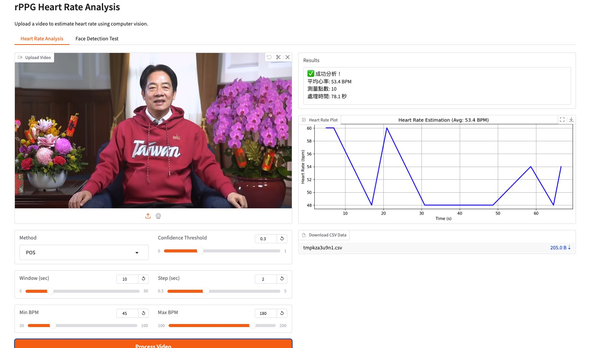

# rPPG 心率估測系統

基於 OpenCV 人臉檢測和 POS 算法


## 特色功能

- **🎯 自包含實現** - 不依賴有問題的外部庫，完全自主實現
- **👥 可靠的人臉檢測** - 使用 OpenCV Haar 級聯，支援多參數組合
- **💓 POS 算法** - Plane-Orthogonal-to-Skin 方法，提供穩健的心率估測
- **📊 即時進度更新** - Console 和 GUI 雙重進度顯示
- **🔍 人臉檢測測試** - 預先檢查影片是否適合分析
- **📈 資料匯出** - 下載心率圖表和 CSV 資料
- **⚡ 高效處理** - 分段處理，2分鐘影片約 30 秒完成

## 快速開始

```bash
# 安裝依賴套件
pip install gradio opencv-python numpy scipy matplotlib tqdm

# 執行應用程式
python app.py
```

在瀏覽器中開啟 `http://127.0.0.1:7860`

## 使用方法

### 心率分析頁面

1. 上傳包含清晰正面人臉的影片檔案
2. 調整參數（預設值通常已足夠）
3. 點擊「Process Video」開始分析
4. 查看結果並下載資料

### 人臉檢測測試頁面

1. 上傳影片進行人臉檢測測試
2. 點擊「Test Face Detection」
3. 確認影片是否適合進行心率分析

## 參數說明

- **方法 (Method)**: POS (Plane-Orthogonal-to-Skin) - 目前唯一實現的方法
- **視窗 (Window)**: 心率計算的時間窗口 (5-30秒，預設: 10秒)
- **步長 (Step)**: 更新間隔 (0.5-5秒，預設: 2秒)
- **心率範圍 (Min/Max BPM)**: 心率過濾範圍 (預設: 45-180 BPM)
- **信心閾值 (Confidence Threshold)**: 有效讀數的最低信心值 (0.0-1.0，預設: 0.3)

## 影片要求

- **清晰正面人臉**: 人臉應清楚可見且面向攝影機
- **良好光線**: 充足的光線，避免強烈陰影
- **最小移動**: 避免過度的頭部移動或攝影機晃動
- **影片長度**: 至少 30 秒以獲得可靠測量
- **解析度**: 較高解析度通常效果更好

## 處理效率

- **分段處理**: 使用滑動窗口，避免逐幀處理
- **智能終止**: 找到足夠測量值後自動停止
- **跳躍讀取**: 直接跳到目標幀，提高效率
- **雙重進度**: Console 和 GUI 進度條同步顯示

---

## rPPG Heart Rate Estimation (English)

A simple and effective implementation for estimating heart rate from video using remote photoplethysmography (rPPG) with OpenCV face detection and POS algorithm.

### Features

- **🎯 Self-contained rPPG implementation** - No dependency on problematic external libraries
- **👥 Reliable face detection** - Uses OpenCV Haar cascades with multiple parameter sets
- **💓 POS algorithm** - Plane-Orthogonal-to-Skin method for robust heart rate estimation
- **📊 Real-time progress updates** - Console and GUI dual progress display
- **🔍 Face detection test** - Pre-check videos for suitability before processing
- **📈 Export capabilities** - Download heart rate plots and CSV data
- **⚡ Efficient processing** - Chunk-based processing, ~30 seconds for 2-minute video

### Quick Start

```bash
# Install dependencies
pip install gradio opencv-python numpy scipy matplotlib tqdm

# Run the application
python app.py
```

Access the web interface at `http://127.0.0.1:7860`

### How to Use

#### Heart Rate Analysis Tab

1. Upload a video file containing a clear frontal face
2. Adjust parameters if needed (defaults work well)
3. Click "Process Video" to start analysis
4. View results and download data

#### Face Detection Test Tab

1. Upload a video to test face detection capability
2. Click "Test Face Detection"
3. Check if your video is suitable for heart rate analysis

### Parameters

- **Method**: POS (Plane-Orthogonal-to-Skin) - Currently the only implemented method
- **Window**: Time window for heart rate calculation (5-30 seconds, default: 10s)
- **Step**: Update interval (0.5-5 seconds, default: 2s)  
- **Min/Max BPM**: Heart rate range filter (default: 45-180 BPM)
- **Confidence Threshold**: Minimum confidence for valid readings (0.0-1.0, default: 0.3)

### Video Requirements

- **Clear frontal face**: Face should be clearly visible and facing the camera
- **Good lighting**: Adequate lighting without harsh shadows
- **Minimal movement**: Avoid excessive head movement or camera shake
- **Duration**: At least 30 seconds for reliable measurements
- **Resolution**: Higher resolution generally works better

### Processing Efficiency

- **Chunk-based processing**: Uses sliding windows, avoids frame-by-frame processing
- **Smart termination**: Automatically stops after finding sufficient measurements
- **Jump reading**: Directly jumps to target frames for improved efficiency
- **Dual progress**: Console and GUI progress bars synchronized

### Technical Details

#### rPPG Implementation

- **Face Detection**: OpenCV Haar cascade classifiers with multiple parameter sets
- **ROI Extraction**: Forehead and cheek regions for optimal signal quality
- **Signal Processing**: POS algorithm with temporal bandpass filtering
- **Heart Rate Estimation**: FFT-based frequency domain analysis

#### Algorithm Overview

1. **Face Detection**: Detect faces using OpenCV with fallback parameters
2. **ROI Selection**: Extract regions of interest from detected faces
3. **Signal Extraction**: Compute mean RGB values from ROI
4. **POS Processing**: Apply Plane-Orthogonal-to-Skin algorithm
5. **Filtering**: Bandpass filter to isolate heart rate frequencies
6. **Estimation**: FFT analysis to find dominant frequency (heart rate)

### Troubleshooting

#### "No faces detected"

- Ensure face is clearly visible and frontal
- Check lighting conditions
- Try the face detection test first
- Consider different camera angles

#### "No heart rate data"

- Reduce confidence threshold
- Increase window size
- Check for excessive movement
- Ensure adequate video length

#### Poor accuracy

- Improve lighting conditions
- Reduce head/camera movement
- Use longer analysis windows
- Check face visibility throughout video

### Files Overview

- `app.py` - Main Gradio application with rPPG implementation
- `requirements.txt` - Python dependencies
- `README.md` - This documentation
- Archive files (app_old.py, etc.) - Previous VitalLens-based implementations

### Advantages Over VitalLens

- **Reliable face detection** - No mysterious "No faces found" errors
- **Self-contained** - No external library dependencies with compatibility issues
- **Transparent processing** - Clear understanding of each processing step
- **Better error handling** - Informative feedback when processing fails
- **Customizable** - Easy to modify algorithm parameters and methods
- **Efficient processing** - Optimized chunk-based algorithm for faster results
